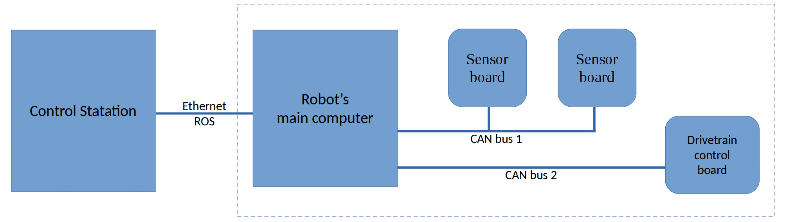
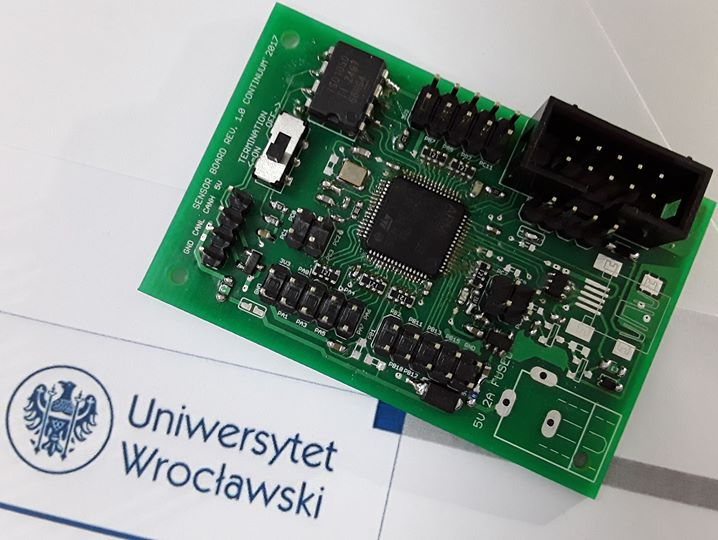
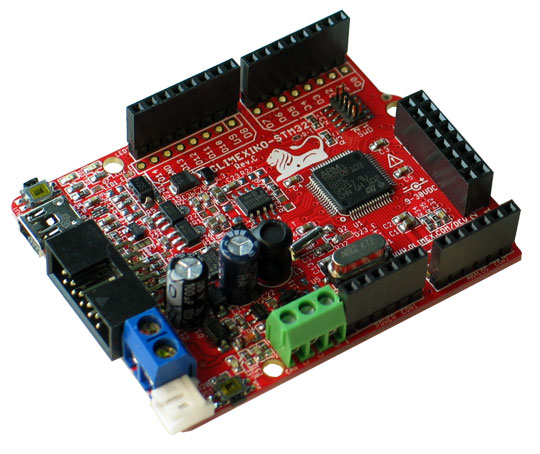
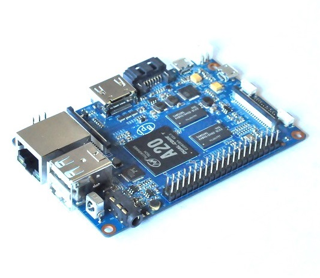

# Rover Universal Board Infrastructure

## General description

Rover Universal Board Infrastructure (RUBI) is a framework designed for rapid and reliable integration of
STM32 microcontroller-based devices with the Robot Operating System (ROS) over the CAN bus.
It was conceived during works on the [Aleph1 rover project](http://continuum.uni.wroc.pl), in which the following systems model was implemented (simplified):



In this model, most of the robot functions (like sensor polling or the motor control) are directly managed by the programmable, universal logic boards, who are equipped with the STM32F103 microcontroller, CAN bus transceiver and a wide range of IO (GPIO, UARTs, SPIs, etc.). Those boards are then connected to the robot’s main computer via multiple CAN buses. It was first planned, that each board will have a separate microcontroller code, a control program on the robot’s main computer, and a separate GUI application. This ‘naive’ workflow of software/firmware development was found not efficient due to the following facts:

- When a new board was added, a new communication layer had to be carefully designed to avoid conflicts with the previous system configuration.
- When a new board was added, the code for all major robot’s components had to be modified and given access to (the code of the developed board, the robot's main computer, and the control station).
- Many of the logic boards need a very simple user interface. For example, the drill controller had four buttons, and the power monitor displayed two integers. The development time for such boards was mainly spent on middleware.
- Writing a separate control program for each board (of which was many) discouraged implementing universal features like a quality service monitor for the communication, board remote reboot, emergency shutdown handling, hot-plug handling etc.

To address these downsides, RUBI is designed so that in most cases, a new board is integrated into the system by specifying its capabilities in the microcontroller code with the provided API, and simply plugging the board into one of the RUBI-controlled CAN buses.

RUBI then dynamically addresses the board, handles communication between the board, the main computer, and the control station, pushes data from the board to the ROS, and depending on the programmer’s choice, either automatically generates user interface for the board, or provides a compact Python API with the previously-specified capabilities for the developer to write a GUI control program himself.

## Subprojects

RUBI consists of four components:

- [rubi_client (link)](https://github.com/acriaer/rubi_client): a framework for board firmware development. Using a set of macros, the programmer defines variables and function callbacks, which will represent the board capabilities, and will be automatically exposed to ROS by rubi.
- rubi_server (this repository): the program which runs on the robot's main computer, keeps track of the connected boards and does all the data synchronization between the ROS and the boards connected across multiple CAN buses,
- rubi_generic_gui: dynamic user interface generator who visualizes connected boards and their exposed interfaces in real-time,
- rubi_custom_gui: a template for custom interface creation with QtDesigner and rqt.

## Hardware

Currently, it is easy to make rubi_client work on any STM32-series microcontroller (provided it is equipped with a CAN bus). It was on extensively tested on the:

<table>
    <tr>
        <th> customly designed logic board with STM32F303RC </th>
        <th> off the shelf OLIMEXINO-STM32 with STM32F103RB </th>
    </tr>
    <tr>
        <td>  </td>
        <td>  </td>
    </tr>
</table>


As of hardware for the rubi_server, it only needs a Linux-based machine with a ROS installation, and a CAN bus accessible by the socketcan. It is also possible to tunnel the CAN traffic over Ethernet with tools like cannelloni, but it is not recommended for any production-like environments.

An interesting configuration was tested using the Banana Pi M1+ microcomputer with the CAN bus on the A20 SoC, and two additional MCP2515s connected over single SPI, and two interrupt lines. This adds up to three CAN buses over two different chips being simultaneously managed by the rubi_server.



## Usage

Provided that you have a rubi-capable board connected to the can bus (let's say its can0), activate the can bus and set the baud rate manually:

>`sudo ip link set can0 down && sudo ip link set can0 type can bitrate 500000 && sudo ip link set can0 up`

Then start the rubi_server:

>`rosrun rubi_server rubi_server _cans:="can0"`

And expect the following output on the console:

```
[ INFO] [1535631798.654781409]: [CommunicationHandler] Handshake complete for board <your board name>
[ INFO] [1535631798.678517125]: [RosModule] Frontend registered new board type: <your board name>
```

The rubi_server should now publish / subscribe to the following ROS topics:

```
/rubi/cans_load     # Usage of the can buses the rubi_server is attached to
/rubi/new_boards    # When a new board is registered, the rubi server publishes an std_msgs::Empty message here
/rubi/panic         # Send std_msgs::Empty message here to restart everything :>
```

Depending on the number of connected boards and their capabilities you should also see board-specific topic, i.e.:

```
/rubi/boards/engine_driver/fields_from_board/current_speed       # Topics that the _board_ publishes into
/rubi/boards/engine_driver/fields_from_board/motor_temperature   #
/rubi/boards/engine_driver/fields_to_board/set_brake             # Topics on which the _board_ receives the data
/rubi/boards/engine_driver/fields_to_board/set_speed             #
/rubi/boards/engine_driver/reboot                                # You can command the rubi-compatible board by sending
/rubi/boards/engine_driver/sleep                                 # std_msgs::Empty onto those topics
/rubi/boards/engine_driver/wake                                  #
```

The rubi_server will also provide you with some services you can use to dynamically explore capabilities of the boards (this is what the automatically-generated GUI uses):

```
/rubi/boards/engine_driver/online   # Use this to check if the board is connected and alive
/rubi/get_board_descriptor          # Get board capabilities (fields and functions)
/rubi/get_cans_names                # Get can buses to which the rubi_server is attached
/rubi/get_field_descriptor          # Get properties of the specific board's field
/rubi/get_func_descriptor           # Get properties of the specific board's function
/rubi/show_boards                   # Get names of the connected boards (even the dead ones)
